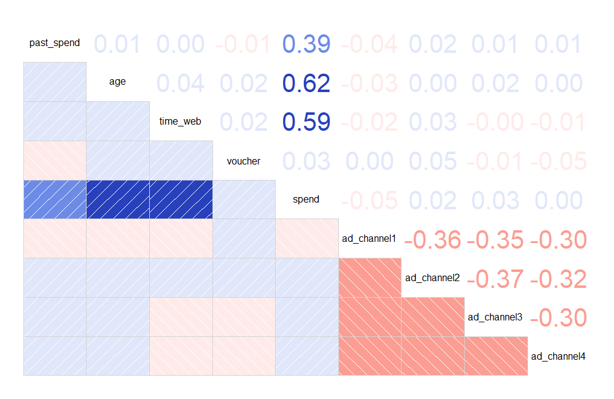
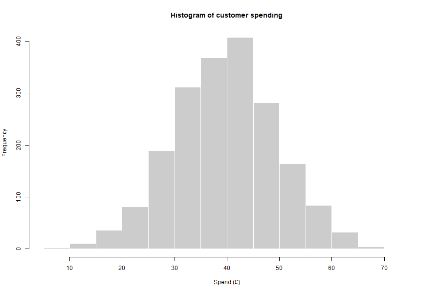
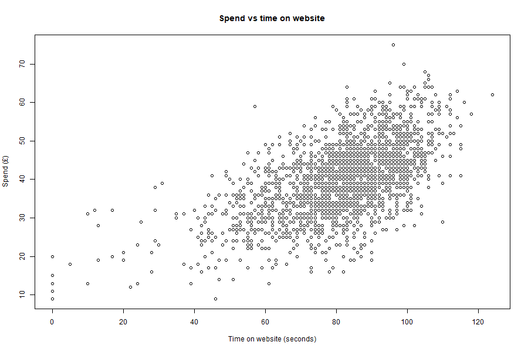
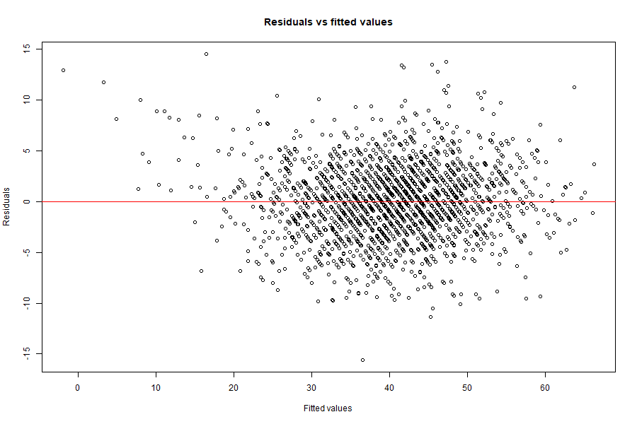

# PhysicalSound Customer Spend Prediction

This project analyses customer spending for **PhysicalSound**, a fictional e-commerce business that sells physical music media such as vinyl, cassettes and CDs.

The aim is to understand which customer and website behaviour variables are linked with higher spending, then build a regression model to predict spending for 20 new customers.

This was originally completed for my MSc Business Analytics module and has been reorganised into a cleaner GitHub portfolio project.

## Business question

The project answers two practical questions:

1. What factors are linked with customers spending more or less on the website?
2. Can customer spending be predicted for new customers using the available order data?

## Dataset

The project uses two CSV files:

- `order_july24.csv`: 2,000 July 2024 sample orders.
- `new_customer24.csv`: 20 new customer records used for prediction.

The target variable is `spend`, which represents the final order value in GBP.

The predictor variables are:

- `past_spend`: previous spending by the customer
- `age`: estimated customer age
- `ad_channel`: channel that brought the customer to the website
- `time_web`: time spent on the website before ordering
- `voucher`: whether a 5% voucher was used

## Methods

The workflow includes:

- missing value checks
- imputation for missing predictor values
- removal of rows where the target variable is missing
- exploratory analysis using histograms, scatterplots and a correlation matrix
- dummy variable creation for advertisement channels
- multiple linear regression modelling
- residual and independence checks
- train/test evaluation using RMSE
- prediction for 20 new customers

## Key findings

The original report found that customer spending was mainly linked with:

- age
- time spent on the website
- previous customer spending

Voucher use and advertisement channel had weaker effects in this sample.

The regression model explained a large share of variation in customer spend in the original coursework analysis, with an RMSE of around £3.47 on the test set.

## Visual outputs

### Correlation matrix



### Spend distribution



### Spend vs time on website



### Residuals vs fitted values



## Project structure

```text
physicalsound-customer-spend-prediction/
│
├── README.md
├── physicalsound-customer-spend-prediction.Rproj
├── scripts/
│   ├── 00_install_packages.R
│   ├── 01_data_preparation.R
│   ├── 02_exploratory_analysis.R
│   ├── 03_model_training.R
│   ├── 04_predict_new_customers.R
│   └── 05_run_all.R
│
├── data/
│   ├── raw/
│   │   ├── order_july24.csv
│   │   └── new_customer24.csv
│   └── processed/
│
├── outputs/
│   ├── figures/
│   ├── tables/
│   └── models/
│
└── reports/
    └── project_summary.md
```

## How to run the project

Open the `.Rproj` file in RStudio, then run:

```r
source("scripts/00_install_packages.R")
source("scripts/05_run_all.R")
```

The scripts will create updated files in:

- `data/processed/`
- `outputs/figures/`
- `outputs/tables/`
- `outputs/models/`

## Skills shown

- R programming
- data cleaning
- missing value treatment
- exploratory data analysis
- regression modelling
- model evaluation
- prediction for new observations
- business-focused interpretation

## Notes

This is a portfolio version of an academic project. The original coursework report has not been included because it contained university submission details. The public version focuses on the data workflow, code, outputs and business interpretation.
